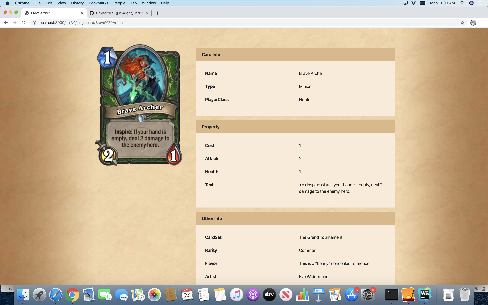

# Hearthstone-Wiki

This project is for the SupplyFrame internship challenge. 

As a crazy Blizzard game fan, I implemented a HearthStone-Wiki project, the data is pulled from
https://hearthstoneapi.com


The goal of this website is to display HearthStone Card data in different ways:

First, users can search cards by PlayerClass. There are 9 classes and 1 neutral catagroy.


Second, users can also grab cards by Rarity. There are 5 rarities in total.


For both searching method, paginaion is implemented and there is also a filter for user to get data of distinct Cost.




Users can also get the card back information form cardback Interface.


UI layout is implemented mainly based on Bootstrap 4.4 and there is also some customed CSS. The architeture for backend is Node + Express + EJS. Because there are some broken image links so I use plain JS in the client end to handle the 404 ERROR and replace them with the default image

## Getting Started

This project is being developed on the macOS 10.15.2. 

### Prerequisites

First, you should install node and then you will get a npm as well.

you can check these following documents for the different OS: 

https://github.com/nodesource/distributions/blob/master/README.md

https://nodejs.org/en/download/package-manager/#debian-and-ubuntu-based-linux-distributions-enterprise-linux-fedora-and-snap-packages

```
# Using macOS

Install Xcode from AppleStore
ruby -e "$(curl -fsSL https://raw.githubusercontent.com/Homebrew/install/master/install)"
brew update
brew install node
```

```
# Using Ubuntu
curl -sL https://deb.nodesource.com/setup_13.x | sudo -E bash -
sudo apt-get install -y nodejs
```

### Installing

Clone this repo 

install the nodemon 

```
npm install -g nodemon
```

## Start the server

cd to the Hearthstone/

```
nodemon start
```

open the brower: 

http://localhost:3000


## Authors

* **Yang Guo** 

